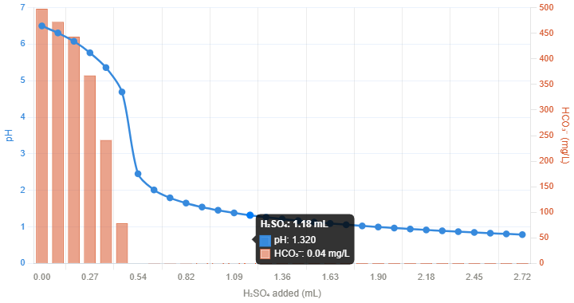

# phreeqc-batch

**Run PHREEQC over hundreds of compositions without hand-writing input files.**

phreeqc-batch provides a thin, opinionated layer on top of PHREEQC bindings
(e.g. phreeqpy's IPhreeqc): template-based input building, typed task execution,
and batch processing over DataFrames or job lists — without hiding the PHREEQC
input format from you.

## Why

The purpose of this package is to simplify using PHREEQC code as a
"production" tool to analyze multiple compositions or scenarios.

Python is commonly used as a wrapper around PHREEQC/IPHREEQC to handle
input data (multiple compositions, variable temperatures, parameter sweeps)
and process output (tables, time series, KPIs). PHREEQC does the work;
Python is the convenient I/O and automation layer. This package consolidates
that wrapper into a small set of classes built around template strings,
DataFrame processing, and a swappable backend.

## When to use it

- A chemistry table of N samples and the same simulation to run on each.
- Sweeping a parameter (acid dose, mixing fraction, temperature) over a
  fixed composition.
- A scenario screening where each job has its own composition *and* its own
  parameters.
- Embedding PHREEQC calls into a data engineering / KPI monitoring workflow.

## When NOT to use it

If you only need to run PHREEQC once or twice, just call phreeqpy directly —
a few more lines but no abstraction overhead.

## Core concepts

**`PhreeqcTemplate`** — a Python format string with named placeholders
(e.g. `"SOLUTION 1\nCl {Cl}"`). Validates required and extra keys before
formatting.

**`SolutionTask`** — pairs a composition template with a run template,
handles the two-step fill (composition → string → injected into run block),
executes PHREEQC, and returns a typed result.

**`MultiSolutionTask`** — like `SolutionTask` but with multiple named
compositions (for MIX, reaction transport, multi-solution blocks).

**`PhreeqcBackend`** — a Protocol decoupling the execution layer from any
specific Python binding. Default implementation `PhreeqpyBackend` wraps
phreeqpy's IPhreeqc.

**Batch runners** — three classes, one per axis-of-variation pattern.
Pick by what changes across jobs:

| Pattern | Compositions | Parameters    | Runner                |
|---------|--------------|---------------|-----------------------|
| A       | Vary         | Fixed         | `SolutionSweepRunner` |
| B       | Fixed        | Vary          | `ParamSweepRunner`    |
| C       | Vary         | Vary          | `FullSweepRunner`     |

All three share the same `run()` / `run_parallel()` API, log failures
without stopping the batch, and support process-based parallelism via
`concurrent.futures.ProcessPoolExecutor`.

## Installation

```bash
pip install phreeqc-batch
```

Requires Python ≥ 3.10 and phreeqpy.

## Quick start — Pattern A: vary compositions

```python
from pathlib import Path
import pandas as pd
from phreeqc_batch import (
    PhreeqcTemplate,
    SolutionTask,
    SolutionSweepRunner,
    PhreeqpyBackend,
)

# Define what your composition looks like in PHREEQC input.
comp_template = PhreeqcTemplate("""\
    units   {units}
    temp    {temp}
    pH      {pH}
    Na      {Na}
    Cl      {Cl}
""")

# Define what to do with it.
run_template = PhreeqcTemplate("""\
SOLUTION 1
{composition_str}

USER_PUNCH
    -headings density
    10 PUNCH RHO

SELECTED_OUTPUT
    -reset false
END
""")

task = SolutionTask(
    task_name="density",
    run_template=run_template,
    composition_template=comp_template,
)

backend = PhreeqpyBackend.create_from_database(
    Path("databases/pitzer.dat")
)

# Run over a DataFrame of samples.
df = pd.DataFrame([
    {"sample_id": "S01", "units": "mmol/L", "temp": 25, "pH": 7.0, "Na": 100, "Cl": 100},
    {"sample_id": "S02", "units": "mmol/L", "temp": 25, "pH": 7.2, "Na": 500, "Cl": 510},
])

runner = SolutionSweepRunner(task=task, id_col="sample_id")
results = runner.run(df, phreeqc=backend)
```

`SolutionSweepRunner` pulls only the columns the composition template needs,
so extra DataFrame columns (notes, dates, lab IDs) are silently ignored.

The result is a list of `PhreeqcResult` objects:

```python
>>> results[0]
PhreeqcResult(id='S01', task_name='density', data=<DataFrame>, metadata={})
>>> results[0].data
    pH  density
0  7.0   1.0023
```

For a runnable single-sample version, see [`examples/01_density_single.py`](examples/01_density_single.py).
For flattening results to a summary DataFrame, see `results_to_scalar_df`
and `results_to_curve_dict`.

## Pattern B: fix compositions, vary parameters

Two fixed brines, sweep over mixing fractions:

```python
from phreeqc_batch import MultiSolutionTask, ParamSweepRunner

mix_template = PhreeqcTemplate(r"""
SOLUTION 1
{solution_1}
SOLUTION 2
{solution_2}

MIX 1
    1   {f1}
    2   {f2}

EQUILIBRIUM_PHASES 1
    Calcite     0   0
    Gypsum      0   0

SELECTED_OUTPUT
    -reset                  false
    -saturation_indices     Calcite Gypsum
    -equilibrium_phases     Calcite Gypsum
END
""")

task = MultiSolutionTask(
    task_name="mixing",
    run_template=mix_template,
    composition_templates={
        "solution_1": comp_template,
        "solution_2": comp_template,
    },
)

# Compositions live on the runner — they don't repeat in each job.
runner = ParamSweepRunner(
    task=task,
    compositions={"solution_1": brine_a, "solution_2": recharge_water},
)

# Jobs hold only the varying parameters.
jobs = [
    {"id": f"mix_{int(f*100):02d}", "f1": f, "f2": 1 - f}
    for f in [0.1, 0.3, 0.5, 0.7, 0.9]
]
results = runner.run(jobs, phreeqc=backend)
```

`ParamSweepRunner` also accepts a DataFrame of parameters with `param_cols`
and `id_col` (same conventions as `SolutionSweepRunner`).

For a single composition with `SolutionTask`, use `composition=...` instead
of `compositions=...`:

```python
runner = ParamSweepRunner(
    task=acid_task,
    composition=brine_sample,
    param_cols=["ph_target"],
    id_col="step",
)
```

## Pattern C: vary everything

Each job carries its own composition(s) and parameters:

```python
from phreeqc_batch import FullSweepRunner

jobs = [
    {
        "id": "scenario_A",
        "compositions": {"solution_1": brine_a1, "solution_2": water_a},
        "f1": 0.7, "f2": 0.3,
    },
    {
        "id": "scenario_B",
        "compositions": {"solution_1": brine_b1, "solution_2": water_b},
        "f1": 0.4, "f2": 0.6,
    },
]
runner = FullSweepRunner(task=mix_task)
results = runner.run(jobs, phreeqc=backend)
```

For `SolutionTask`, each job uses `composition` (singular) instead of
`compositions`.

## Parallel execution

All three runners share the same `run_parallel` API. Each worker process
creates and caches its own backend (PHREEQC's DLL is not shareable across
processes).

```python
from functools import partial
from phreeqc_batch import PhreeqpyBackend

factory = partial(PhreeqpyBackend.create_from_database, Path("databases/pitzer.dat"))

results = runner.run_parallel(
    df,
    backend_factory=factory,
    n_workers=4,
)
```

The `backend_factory` must be picklable (module-level function or
`functools.partial`, not a lambda or closure). Worth the overhead for
batches of roughly 50+ jobs.

## Custom templates

Any PHREEQC input block can be wrapped in a `PhreeqcTemplate`:

```python
si_template = PhreeqcTemplate(r"""
SOLUTION 1
{composition_str}

SELECTED_OUTPUT
  -reset false
  -saturation_indices Calcite Dolomite Gypsum
END
""")

task = SolutionTask(
    task_name="saturation_indices",
    run_template=si_template,
    composition_template=comp_template,
)
```

The package ships a few defaults in `phreeqc_batch.templates`:

- `DEFAULT_COMPOSITION_TEMPLATE` — full ionic composition with density,
  temperature, pH.
- `DEFAULT_COMPOSITION_NO_CONDITIONS_TEMPLATE` — composition only, no
  pH / density / temperature.
- `DEFAULT_SOLUTION_RUN_TEMPLATE` — minimal run block with density punch.

## Custom backend

If `phreeqpy` ever stops being maintained, or a faster binding shows up,
swap the backend by implementing the Protocol — nothing else in the
package cares which one you use.

```python
class MyBackend:
    def run(self, input: str) -> None:
        ...
    def get_selected_output_array(self) -> list:
        ...
```

## Examples

See [`examples/`](examples/) for runnable scripts:

- `01_density_single.py` — minimal single-sample density calculation.
- `02_density_batch.py` — batch density over a DataFrame of brine samples
  (Pattern A).
- `03_brine_mixing.py` — two-brine mixing with carbonate/sulfate
  equilibration (Pattern B).
- `04_saturation_indices_puna.py` — saturation indices over a public
  dataset of salars from the Puna region.
- `05_acidification.py` — stepwise H₂SO₄ titration of a Salar de Atacama
  brine, with buffer consumption and sulfate scaling tracking.



*H₂SO₄ titration of a Salar de Atacama brine: pH drops sharply once the
HCO₃⁻ buffer (orange bars) is consumed.*

## Status

Beta. Core API (templates, tasks, runners, backend) is stable and tested.
Future work: additional backend implementations, richer post-processing
utilities. Feedback and contributions welcome.

## License

MIT